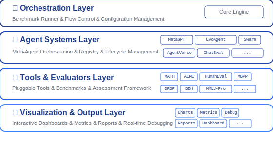

# <div align="center">

  <h1 align="center">MASArena 🏟️</h1>
  <!-- <p align="center"><i>Multi-Agent Systems Arena</i></p> -->
  <p align="center">
    <a href="https://www.python.org/downloads/"></a>
    <a href="https://opensource.org/licenses/MIT"></a>
    <a href="https://lins-lab.github.io/MASArena"></a>
    <a href="https://deepwiki.com/LINs-lab/MASArena"></a>
  </p>
  
  
  <p align="center">
    <b>Layered Architecture</b> • <b>Stack</b> • <b>Swap</b> • <b>Built for Scale</b>
  </p>
  
</div>

## 🌟 Core Features

* **🧱 Modular Design**: Swap agents, tools, datasets, prompts, and evaluators with ease.
* **📦 Built-in Benchmarks**: Single/multi-agent datasets for direct comparison.
* **📊 Visual Debugging**: Inspect interactions, accuracy, and tool use.
* **🤖 Automated Workflow Optimization**: Automatically optimize agent workflows using LLM-driven evolutionary algorithms.
* **🔧 Tool Support**:  Manage tool selection via pluggable wrappers.
* **🧩 Easy Extensions**: Add agents via subclassing—no core changes.
* **📂 Paired Datasets & Evaluators**: Add new benchmarks with minimal effort.
* **🔍 Failure Attribution**: Identify failure causes and responsible agents.

## 🎬 Demo

See MASArena in action! This demo showcases the framework's visualization capabilities:

https://github.com/user-attachments/assets/b6e56eef-e00e-46bb-97e0-02d2aca47403

## 🚀 Quick Start

### 1. Setup

We recommend using [uv](https://docs.astral.sh/uv/) for dependency and virtual environment management.

```bash
# Install dependencies
uv sync

# Activate the virtual environment
source .venv/bin/activate
```

### 2. Configure Environment Variables

Create a `.env` file in the project root and set the following:

```bash
OPENAI_API_KEY=your_openai_api_key
MODEL_NAME=gpt-4o-mini
OPENAI_API_BASE=https://api.openai.com/v1
```

### 3. Running Benchmarks

```bash
# Run a standard benchmark (e.g., math with supervisor_mas agent)
./run_benchmark.sh math supervisor_mas 10

# Run the AFlow optimizer on the humaneval benchmark
./run_benchmark.sh humaneval single_agent 10 "" "" aflow
```
* Supported benchmarks: 
  * Math: `math`, `aime`
  * Code: `humaneval`, `mbpp`
  * Reasoning: `drop`, `bbh`, `mmlu_pro`, `ifeval`, `hotpotqa`
* Supported agent systems: 
  * Single Agent: `single_agent`
  * Multi-Agent: `supervisor_mas`, `swarm`, `agentverse`, `chateval`, `evoagent`, `jarvis`, `metagpt`

## 📚 Documentation

For comprehensive guides, tutorials, and API references, visit our complete [documentation](https://lins-lab.github.io/MASArena).

## ✅ TODOs

* [x] Add asynchronous support for model calls
* [x] Implement failure detection in MAS workflows
* [ ] Add more benchmarks emphasizing tool usage
* [ ] Improve configuration for MAS and tool integration
* [ ] Integrate multiple tools(e.g., Browser, Video, Audio, Docker) into the current evaluation framework
* [ ] Optimize the framework's tool management architecture to decouple MCP tool invocation from local tool invocation
* [ ] Implement more benchmark evaluations(e.g., webArena, SweBench) that requires tool usage
* [ ] Reimplementation of the Dynamic Architecture Paper Based on the Benchmark Framework

## 🙌 Contributing

We warmly welcome contributions from the community!

**📋 For detailed contribution guidelines, testing procedures, and development setup, please see [CONTRIBUTING.md](docs/quick_start/CONTRIBUTING.md).**

You can contribute in many ways:

* 🧠 **New Agent Systems (MAS):**
  Add novel single- or multi-agent systems to expand the diversity of strategies and coordination models.

* 📊 **New Benchmark Datasets:**
  Bring in domain-specific or task-specific datasets (e.g., reasoning, planning, tool-use, collaboration) to broaden the scope of evaluation.

* 🛠 **New Tools & Toolkits:**
  Extend the framework's tool ecosystem by integrating domain tools (e.g., search, calculators, code editors) and improving tool selection strategies.

* ⚙️ **Improvements & Utilities:**
  Help with performance optimization, failure handling, asynchronous processing, or new visualizations.

### Quick Start for Contributors

1. **Fork and Clone**: Fork the repository and clone it locally
2. **Setup Environment**: Install dependencies with `pip install -r requirements.txt`
3. **Run Tests**: Execute `pytest tests/` to ensure everything works
4. **Make Changes**: Implement your feature with corresponding tests
5. **Submit PR**: Create a pull request with a clear description

Our automated CI/CD pipeline will run tests on every pull request to ensure code quality and reliability.
