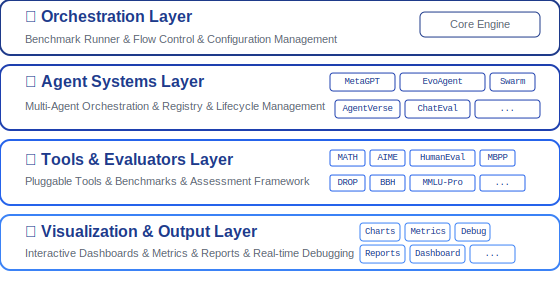

# Welcome to MASArena 🏟️ !

A comprehensive framework for benchmarking single and multi-agent systems across a wide range of tasks—evaluating performance, accuracy, and efficiency with built-in visualization and tool integration.

## 🌟 Core Features

* **🧱 Modular Design**: Swap agents, tools, datasets, prompts, and evaluators with ease.
* **📦 Built-in Benchmarks**: Single/multi-agent datasets for direct comparison.
* **📊 Visual Debugging**: Inspect interactions, accuracy, and tool use.
* **🔧 Tool Support**:  Manage tool selection via pluggable wrappers.
* **🧩 Easy Extensions**: Add agents via subclassing—no core changes.
* **📂 Paired Datasets & Evaluators**: Add new benchmarks with minimal effort.

## 🙌 Contributing

We warmly welcome contributions from the community!

You can contribute in many ways:

* 🧠 **New Agent Systems (MAS):**
  Add novel single- or multi-agent systems to expand the diversity of strategies and coordination models.

* 📊 **New Benchmark Datasets:**
  Bring in domain-specific or task-specific datasets (e.g., reasoning, planning, tool-use, collaboration) to broaden the scope of evaluation.

* 🛠 **New Tools & Toolkits:**
  Extend the framework's tool ecosystem by integrating domain tools (e.g., search, calculators, code editors) and improving tool selection strategies.

* ⚙️ **Improvements & Utilities:**
  Help with performance optimization, failure handling, asynchronous processing, or new visualizations.
