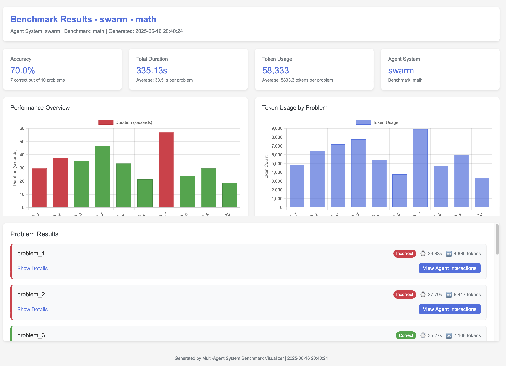
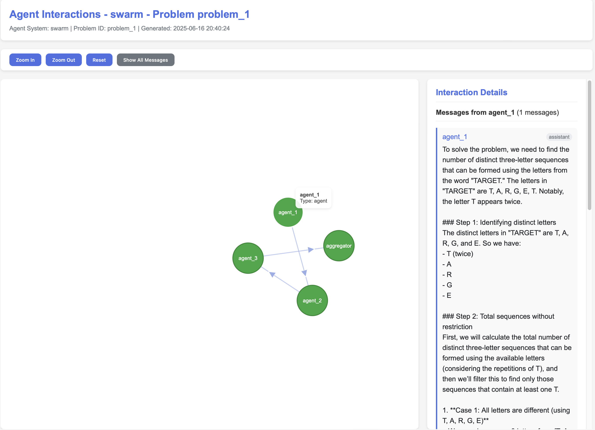

# Visualizing Agent Interactions

You can generate an interactive HTML file to visualize agent message flows and other metadata from a completed benchmark run.

```bash
python mas_arena/visualization/visualize_benchmark.py visualize \
  --summary results/math_swarm_20250616_203434_summary.json
```

This is particularly useful for debugging and analyzing the behavior of multi-agent systems.



