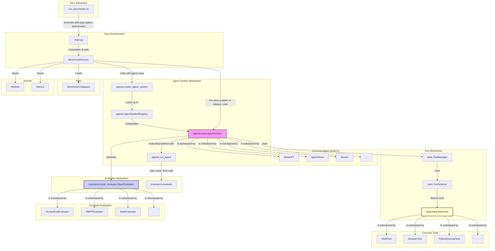
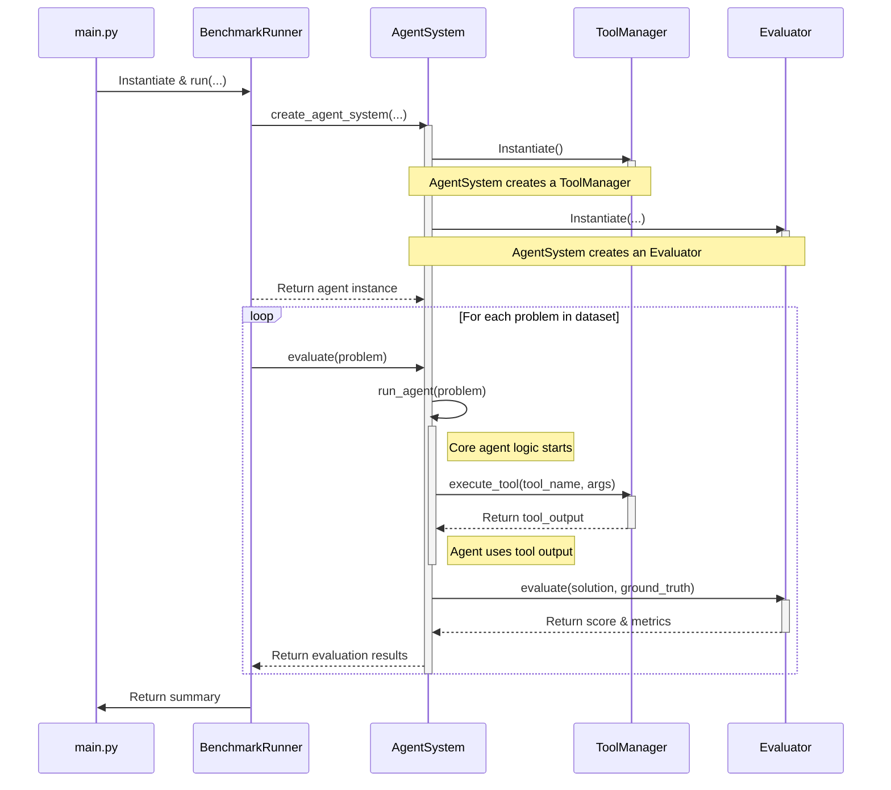
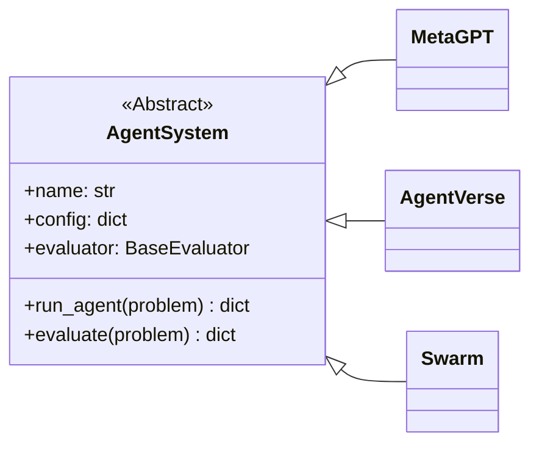
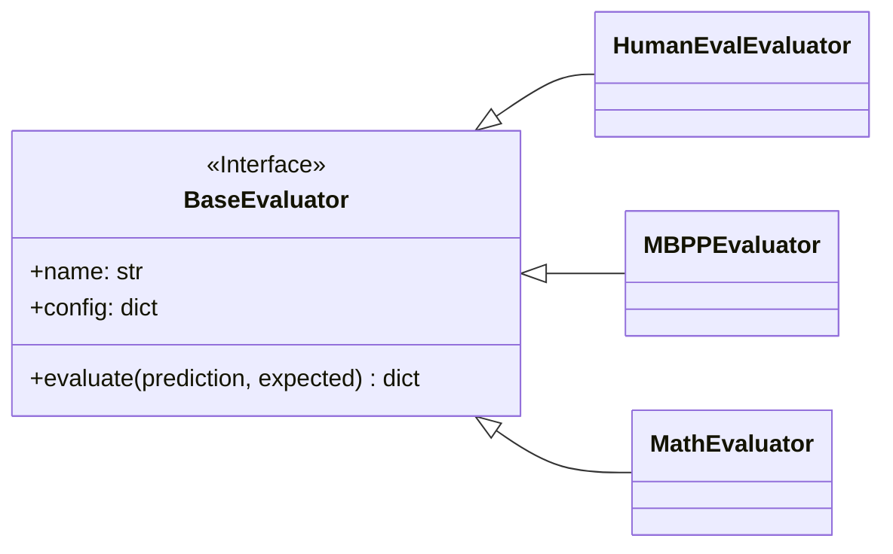

# System Architecture

This document provides a detailed overview of the MAS Arena system's architecture. It explains the core components, their interactions, and the overall data flow when running a benchmark.

## High-Level Architecture

The system is designed to be modular and extensible, allowing for easy addition of new agent systems and benchmarks. The core components are the `BenchmarkRunner`, `AgentSystem`, and `Evaluator`. The `BenchmarkRunner` orchestrates the process, while the `AgentSystem` encapsulates the logic for both solving a problem and evaluating its own solution.

## Execution Workflow

The following sequence diagram illustrates the step-by-step workflow when a benchmark is executed. A key design choice is that the `AgentSystem` is responsible for its own evaluation. It creates an appropriate `Evaluator` during its initialization and uses it to score the solutions it generates.

## Core Components Decomposition

The framework's modularity comes from its use of abstract base classes and registries for dynamic discovery.

### Agent Systems

All agent systems inherit from the `AgentSystem` abstract base class. This ensures they conform to a common interface, which includes the `run_agent()` and `evaluate()` methods. The `AgentSystemRegistry` is used to discover and list available agents.

### Evaluators

Similarly, all evaluators inherit from a `BaseEvaluator` class (though not strictly enforced as an ABC in the current implementation, it serves this role conceptually). The `AVAILABLE_EVALUATORS` dictionary in `mas_arena/evaluators/__init__.py` acts as a registry.

## Extensibility

Adding a new agent or evaluator to the system is straightforward.

### Adding a New Agent
1.  Create a new Python file in `mas_arena/agents/`.
2.  Implement a new class that inherits from `agents.base.AgentSystem`.
3.  Implement the abstract `run_agent()` method with the agent's unique logic.
4.  Register the new agent in `mas_arena/agents/__init__.py` by adding it to the `AVAILABLE_AGENT_SYSTEMS` dictionary and the `__all__` list.

### Adding a New Evaluator
1.  Create a new Python file in `mas_arena/evaluators/`.
2.  Implement a new class that provides an `evaluate()` method.
3.  Register the new evaluator in `mas_arena/evaluators/__init__.py` by adding it to the `AVAILABLE_EVALUATORS` dictionary.