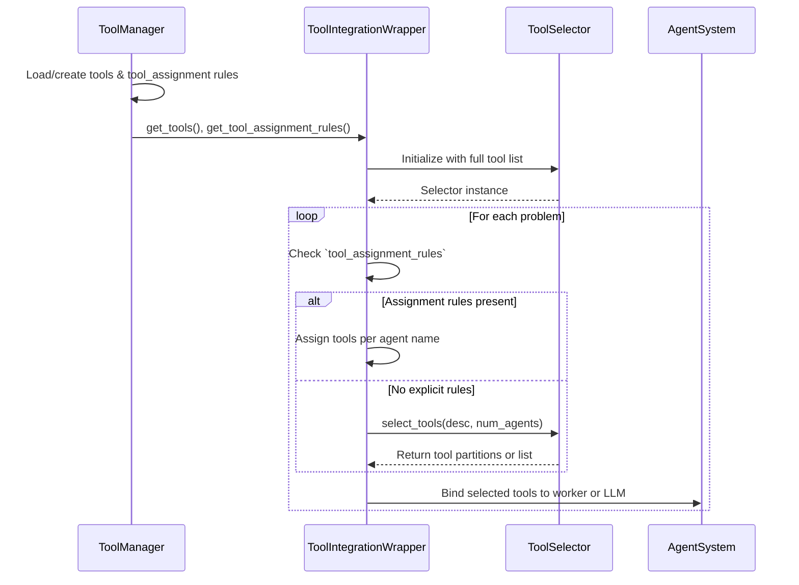

# Tool Integration System


## Overview

The tool integration system allows agent systems to leverage external tools (like calculators, search engines, or specialized APIs) to enhance their problem-solving capabilities. Tool integration is implemented through three main components:

### Components

1. **ToolManager**  
   - Loads and manages tool instances (MCP tools or mock tools).  
   - Standardizes tools into a common dictionary format via `get_tools()`.  
   - Loads optional `tool_assignment` rules from the MCP configuration and exposes them via `get_tool_assignment_rules()`.

2. **ToolSelector**  
   - Provides a single public method `select_tools(task_description, num_agents=None, overlap=False, limit=5)`.  
   - Internally uses `_select_for_task` for single-agent and `_partition_tools_for_multi_agent` for multi-agent.  
   - Deprecated wrappers for the old `select_for_task` and `partition_tools_for_multi_agent` remain for backward compatibility.  
   - Override `select_tools` to implement custom selection algorithms.

3. **ToolIntegrationWrapper**  
   - Wraps an `AgentSystem` to inject tool integration without modifying agent code.  
   - Initializes `ToolManager` and `ToolSelector` on the agent.  
   - Patches multi-agent systems by intercepting `_create_agents`, applying `tool_assignment` rules if present, or falling back to `select_tools(...)`, then binds tools to each worker LLM.  
   - Patches single-agent systems by intercepting `run_agent`, selecting tools before the run, and binding them to the agent's LLM.

## Configuration

To enable MCP tool integration in the CLI or `run_benchmark.sh`, include the flags:
```
--use-mcp-tools --mcp-config-file path/to/mcp_config.json
```
The MCP config JSON can define both server endpoints and assignment rules:

```json
{
  "math": { "command": "python", "args": ["math_server.py"], "transport": "stdio" },
  "search": { "command": "python", "args": ["search_server.py"], "transport": "stdio" },
  "tool_assignment": {
    "MathAgent": ["add", "subtract", "solve_math"],
    "SearchAgent": ["search"],
    "Reasoner": ["infer"]
  }
}
```

`ToolManager.from_config_file` will split out the `tool_assignment` section into assignment rules and treat the remaining keys as MCP server definitions.

## How They Work Together



## Developer Guide: Implementing a Tool-Compatible AgentSystem

To make your `AgentSystem` (or its internal worker components) compatible with the `ToolIntegrationWrapper` and enable tool usage, follow these guidelines:

**Key Requirements:**

1.  **`llm` Attribute**: Any component (the main agent system instance for single-agent systems, or individual worker objects in multi-agent systems) that is intended to have tools bound to its Language Model (LLM) *must* expose that LLM instance via an attribute named `llm`.
    *Example*: `self.llm = ChatOpenAI(...)` or `worker_instance.llm = ChatOpenAI(...)`

2.  **`name` Attribute**: It's highly recommended that these components also have a `name` string attribute (e.g., `self.name = "MyAgent"` or `worker_instance.name = "Researcher"`). This name is used for:
    *   Logging by the `ToolIntegrationWrapper`.
    *   Targeted tool assignment if you use `tool_assignment` rules in your MCP configuration. If missing, a default name like `worker_0` will be used.

3.  **`_create_agents` Method (for Multi-Agent Systems)**:
    *   If you are building a multi-agent system where tools should be distributed to different worker agents, your `AgentSystem` subclass should implement a method:
        `def _create_agents(self, problem_input: Optional[Any] = None, feedback: Optional[Any] = None) -> Union[List[Any], Dict[str, Any]]:`
    *   This method is called by `ToolIntegrationWrapper` to get the worker components.
    *   **Return Value Flexibility**:
        *   **Option 1 (Recommended for direct use in agent logic):** Return a dictionary where keys are worker names (or any identifier) and values are the worker objects themselves. `ToolIntegrationWrapper` will process the *values* of this dictionary as the workers.
            *Example:* `return {"researcher": self.research_agent_node, "coder": self.coder_agent_node}`
        *   **Option 2 (Simple List):** Return a direct list of worker objects.
            *Example:* `return [self.research_agent_node, self.coder_agent_node]`
        *   **Option 3 (Legacy):** Return a dictionary `{"workers": [worker_object1, worker_object2, ...]}`.
    *   `ToolIntegrationWrapper` processes the identified worker objects *in place* (sets a `tools` attribute and rebinds their `llm` attribute if tools are assigned). The original structure returned by your `_create_agents` (list or dict) will be returned by the patched version, containing these modified worker objects.

**Example: `SimpleSupervisor` (Multi-Agent System)**

Here's a simplified example demonstrating a supervisor agent system:

```python
from typing import Dict, List, Any, Optional, Union
from langchain_openai import ChatOpenAI
from mas_arena.agents.base import AgentSystem # Assuming AgentSystem is in this path

# A simple worker node
class SimpleAgentNode:
    def __init__(self, name: str, model_name: str = "gpt-4o-mini"):
        self.name = name
        self.model_name = model_name
        # Expose the LLM for ToolIntegrationWrapper
        self.llm = ChatOpenAI(model=self.model_name)
        # Tools will be assigned here by ToolIntegrationWrapper via setattr(self, "tools", ...)
        # and self.llm will be rebound if tools are assigned.

    def run(self, task: str) -> str:
        # In a real scenario, this would invoke self.llm with tools
        # For this example, we just acknowledge the tools if present.
        if hasattr(self, 'tools') and self.tools:
            tool_names = [t.get('name', 'unknown_tool') for t in self.tools]
            return f"{self.name} would run task '{task}' with tools: {tool_names}"
        return f"{self.name} would run task '{task}' (no tools assigned/bound)"


class SimpleSupervisor(AgentSystem):
    def __init__(self, name: str = "SimpleSupervisor", config: Dict[str, Any] = None):
        super().__init__(name, config)
        # The actual worker instances will be created and managed via _create_agents
        # and the graph/logic in run_agent.
        self.worker_nodes = None  # Populated by run_agent calling _init_workers
        self.graph = None  # Placeholder for a more complex execution graph

    def _create_agents(self, problem_input: Optional[Any] = None, feedback: Optional[Any] = None) -> Dict[
        str, SimpleAgentNode]:
        """Creates worker agents and returns them in a dictionary."""
        researcher_model = self.config.get("researcher_model", "gpt-4o-mini")
        coder_model = self.config.get("coder_model", "gpt-4o-mini")

        researcher = SimpleAgentNode(name="researcher", model_name=researcher_model)
        coder = SimpleAgentNode(name="coder", model_name=coder_model)

        # Return a dictionary; ToolIntegrationWrapper will process the values.
        # The wrapper will modify these researcher and coder instances in place.
        return {
            "researcher": researcher,
            "coder": coder
        }

    def _init_workers_if_needed(self, problem_input: Optional[Any] = None):
        if self.worker_nodes is None:
            # When wrapped, this calls the TIW-patched version of _create_agents.
            # It receives the same dictionary structure, but the SimpleAgentNode
            # instances within it will have been configured with tools by TIW.
            self.worker_nodes = self._create_agents(problem_input=problem_input)

    def run_agent(self, problem: Dict[str, Any], **kwargs) -> Dict[str, Any]:
        problem_content = problem.get("problem", "Analyze quantum entanglement.")
        self._init_workers_if_needed(problem_input=problem_content)

        # Directly use the workers from the dictionary
        researcher_node = self.worker_nodes["researcher"]
        coder_node = self.worker_nodes["coder"]

        # Example delegation (simplified)
        research_result = researcher_node.run(f"Research for: {problem_content}")
        final_result = coder_node.run(f"Code based on: {research_result}")

        return {"messages": [(self.name, final_result)]}

```

**How `ToolIntegrationWrapper` Interacts with `SimpleSupervisor`:**
1.  When `SimpleSupervisor` is wrapped, `ToolIntegrationWrapper` patches its `_create_agents` method.
2.  During `simple_supervisor_instance.run_agent(...)`, the call to `self._init_workers_if_needed()` eventually calls the patched `_create_agents`.
3.  The original `_create_agents` logic runs, returning `{"researcher": researcher_node, "coder": coder_node}`.
4.  `ToolIntegrationWrapper` sees this dictionary. It iterates through its values (`researcher_node`, `coder_node`).
5.  For each node, it selects/assigns tools and binds them to `node.llm`. The `tools` attribute is also set on the node.
6.  The patched `_create_agents` returns the original dictionary structure, but the `researcher_node` and `coder_node` objects *within* it are now modified with tools and rebound LLMs.
7.  `_init_workers_if_needed` in `SimpleSupervisor` receives this dictionary and can directly use `self.worker_nodes["researcher"]` etc., which are now tool-enabled.

**Single-Agent Systems:**

For agent systems that do *not* implement `_create_agents` (e.g., a single monolithic agent):
- `ToolIntegrationWrapper` will attempt to patch the `run_agent` method.
- It expects the agent system instance itself to have an `llm` attribute (e.g., `self.llm`).
- Tools selected for the task will be bound to this top-level `self.llm`.
- Ensure such agent systems have `self.name` and `self.llm` for proper integration.

By adhering to these conventions, developers can more easily integrate their agent systems with the tool framework, leveraging its automated tool selection and LLM binding capabilities.
